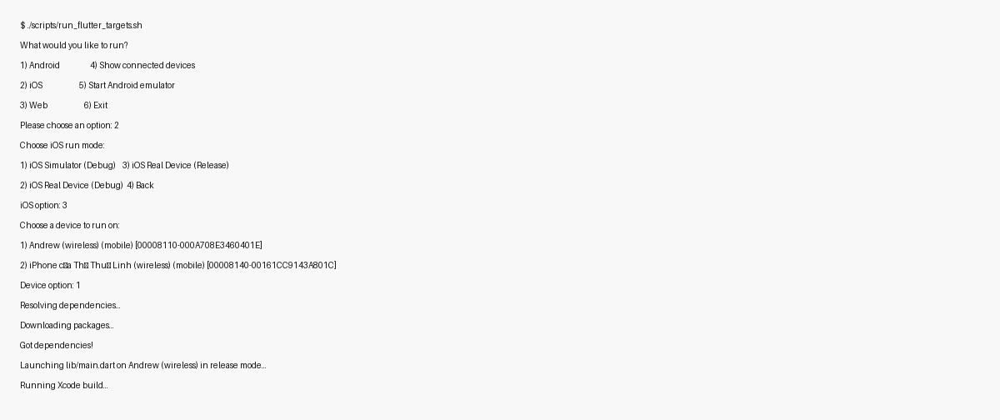

# BeFam

BeFam is a mobile-first platform for genealogy and clan operations.
This repository is the source-of-truth workspace for product direction,
architecture, implementation, and release operations.

## Language Structure

- English docs: `docs/en/**`
- Vietnamese docs: `docs/vi/**`

## Product Snapshot

BeFam combines genealogy, clan operations, and secure membership access in one
mobile experience.

Current live capability baseline includes:

- phone OTP and child-access authentication flows
- clan/member/relationship/genealogy workspaces
- dual calendar events (solar + lunar)
- funds and scholarship modules
- discovery and join-request flow
- profile and settings baseline
- Store IAP billing flow (Apple App Store / Google Play) with card checkout support

## Repository Structure

- `docs/`: MkDocs documentation source
- `mobile/befam/`: Flutter mobile application
- `firebase/`: Firestore rules/indexes, Storage rules, Cloud Functions
- `.github/`: CI/CD workflows and GitHub automation
- `scripts/`: release/configuration/backlog helper scripts

## Documentation Entry Points

- Documentation site: [phamhungptithcm.github.io/gia-pha](https://phamhungptithcm.github.io/gia-pha/)
- English docs hub: `docs/en/index.md`
- Vietnamese docs hub: `docs/vi/index.md`
- Production config runbook (EN): `docs/en/05-devops/production-configuration.md`
- Production config runbook (VI): `docs/vi/05-devops/production-configuration.md`

## Local Development

### One-command setup

Use this script to auto-setup the local environment for Flutter app + Firebase Functions:

```bash
./scripts/setup_project_env.sh
```

Useful options:

```bash
./scripts/setup_project_env.sh --mobile-only
./scripts/setup_project_env.sh --functions-only
./scripts/setup_project_env.sh --skip-ios-pods
./scripts/setup_project_env.sh --install-missing
```

### Preview docs

```bash
python3 -m venv .venv
source .venv/bin/activate
pip install -r requirements-docs.txt
mkdocs serve
```

### Validate docs

```bash
mkdocs build --strict
```

### Flutter app

```bash
cd mobile/befam
flutter pub get
flutter analyze
flutter test
flutter run
```

### Android Release (Production Best Practice)

```bash
cd mobile/befam
flutter clean
flutter pub get
flutter build appbundle --release
```

Mental model:

- Flutter code -> Gradle -> AAB -> Google Play -> device-specific APK
- Keep Crashlytics enabled for release builds
- Avoid `print`-style logging in release code paths

### Flutter Run Helper Script

Use the helper script when you want a simple guided menu to run on Android, iOS, or Web without manually typing every target/device flag.

```bash
./scripts/run_flutter_targets.sh
```

You can still call specific targets directly if needed:

```bash
./scripts/run_flutter_targets.sh devices
./scripts/run_flutter_targets.sh android-sim
./scripts/run_flutter_targets.sh android-build-aab
./scripts/run_flutter_targets.sh android-build-aab-ci
./scripts/run_flutter_targets.sh ios-device-release
./scripts/run_flutter_targets.sh web-server 8080
```

Android production-style local build (same sequence as CI):

```bash
./scripts/run_flutter_targets.sh android-build-aab
```

Optional build metadata override:

```bash
BEFAM_BUILD_NAME=1.2.3 BEFAM_BUILD_NUMBER=123 ./scripts/run_flutter_targets.sh android-build-aab
```

Interactive wizard example:



## Web Hosting and Monitoring

- Web deployment workflow: `.github/workflows/deploy-web-hosting.yml`
  - `staging` pushes deploy to Firebase Hosting preview channel (default: `staging`)
  - `main` pushes deploy to Firebase Hosting production
- Monitoring workflow: `.github/workflows/monitoring-healthcheck.yml`
  - Runs every 15 minutes
  - Verifies web routes (`/`, `/app`) and Functions health endpoint (`appHealthCheck`)

Recommended GitHub repository variables:

- `FIREBASE_PROJECT_ID`
- `FIREBASE_FUNCTIONS_REGION`
- `FIREBASE_HOSTING_TARGET` (optional, multi-site)
- `FIREBASE_HOSTING_STAGING_CHANNEL` (optional, default `staging`)
- `BEFAM_WEB_BASE_URL` (optional, overrides default `https://<project>.web.app`)
- `BEFAM_HEALTHCHECK_URL` (optional, overrides default Functions URL)
