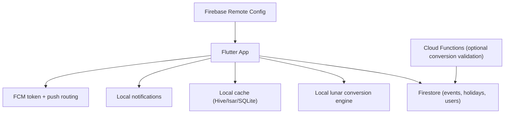

# Epic: Dual Calendar System (Solar + Asian Lunar)

_Last reviewed: March 14, 2026_

## Goal

Enable users to view and schedule events with both Gregorian (solar) and Asian
lunar calendars in the BeFam Flutter app, backed by Firebase.

The system supports:

- lunar date display in calendar views
- lunar holiday highlighting
- event creation and recurrence by lunar date
- regional lunar calendar differences (CN, VN, KR)

## Scope

### In scope

- dual date display in month/day calendar views
- local solar-lunar conversion in Flutter with cache
- Firestore model support for lunar events and holiday definitions
- annual lunar recurrence resolution to solar dates
- leap month rule support for recurring events
- reminder scheduling after yearly lunar-to-solar resolution

### Out of scope (for this epic)

- server-only conversion as the primary path
- support for non-Asian lunar systems
- full editorial holiday CMS outside Firestore/Remote Config

## Architecture overview



## Core capabilities

1. Solar + lunar date display
2. Solar to lunar and lunar to solar conversion
3. Lunar holiday highlighting
4. Lunar-based recurring events
5. Regional lunar calendar support (CN, VN, KR)
6. Firebase-backed event storage
7. Notification scheduling for resolved dates

## User stories and acceptance criteria

### Story 1: Calendar UI with dual dates

As a user, I can see lunar dates under each solar date tile.

Acceptance criteria:

- month and day views display both date systems
- day tile format supports:

```text
17
Lunar 1/1
```

- selected region affects displayed lunar values

### Story 2: Local lunar conversion engine

As the system, conversion runs locally so calendar rendering stays fast and
offline-friendly.

Acceptance criteria:

- conversion executes in Flutter without network dependency
- conversion API is wrapped behind a repository/service interface
- optional Cloud Function fallback can be enabled for validation

### Story 3: Lunar holiday highlighting

As a user, I can see important lunar holidays in the calendar.

Acceptance criteria:

- holidays are loaded from `lunar_holidays`
- highlight logic matches `lunarMonth`, `lunarDay`, and region
- default holiday set includes Lunar New Year, Lantern Festival, Dragon Boat,
  and Mid-Autumn

### Story 4: Create events using lunar dates

As a user, I can create an event as solar or lunar.

Acceptance criteria:

- create/edit form supports `dateType` radio selection (`solar` or `lunar`)
- lunar events save `lunarMonth`, `lunarDay`, `isLeapMonth`
- solar events save `solarDate` and leave lunar fields null

### Story 5: Annual lunar resolution

As the system, lunar recurring events are resolved into solar dates for each
year.

Acceptance criteria:

- yearly resolution happens on device for the active user view window
- resolved dates are used by calendar rendering and reminders
- recurrence remains stable across app restarts via local cache

### Story 6: Leap month handling

As the system, leap months are resolved by explicit recurrence rules.

Acceptance criteria:

- event model supports `leapMonthRule`
- supported rule values:
  - `skip`
  - `firstOccurrence`
  - `leapOccurrence`
- resolution logic is deterministic and covered by tests

### Story 7: Regional lunar settings

As a user, I can choose a calendar region for lunar interpretation.

Acceptance criteria:

- profile includes `calendarRegion` (`CN`, `VN`, `KR`)
- calendar and event resolution use selected region
- changing region invalidates/rebuilds relevant local cache entries

### Story 8: Conversion caching

As the system, conversion results are cached locally.

Acceptance criteria:

- cache key format includes region and solar date
- cache hits reduce conversion calls during month navigation
- cache invalidation policy exists for version or ruleset changes

### Story 9: Notification scheduling

As a user, I receive reminders for lunar events on resolved solar dates.

Acceptance criteria:

- reminder flow:

```text
Lunar event -> resolve to solar date -> schedule notification
```

- local reminders are refreshed when yearly resolution changes
- optional FCM path remains available for server-driven reminders

### Story 10: Performance optimization

As the system, calendar interactions stay responsive at scale.

Acceptance criteria:

- batched Firestore reads by visible date window
- monthly preloading and local event cache
- smooth month scrolling under heavy event volume

## Data model

### `users/{uid}`

- `calendarRegion`: `CN | VN | KR` (default `VN`)
- `calendarDisplayMode`: `solar | lunar | dual`

### `events/{eventId}`

- `userId`: string
- `title`: string
- `dateType`: `solar | lunar`
- `solarDate`: timestamp nullable
- `lunarMonth`: number nullable
- `lunarDay`: number nullable
- `isLeapMonth`: boolean nullable
- `leapMonthRule`: `skip | firstOccurrence | leapOccurrence` nullable
- `timezone`: string (IANA, for reminder precision)

Example lunar event:

```json
{
  "userId": "uid",
  "title": "Grandma Birthday",
  "dateType": "lunar",
  "lunarMonth": 6,
  "lunarDay": 5,
  "isLeapMonth": false,
  "leapMonthRule": "firstOccurrence",
  "solarDate": null
}
```

### `lunar_holidays/{id}`

- `name`: string
- `lunarMonth`: number
- `lunarDay`: number
- `regions`: array of `CN | VN | KR`

Example:

```json
{
  "name": "Mid Autumn Festival",
  "lunarMonth": 8,
  "lunarDay": 15,
  "regions": ["CN", "VN", "KR"]
}
```

## Technical decisions and tradeoffs

### Primary approach

Client-side conversion in Flutter with optional server validation path.

Benefits:

- offline support
- lower Firebase cost
- faster rendering and interaction

Costs:

- conversion behavior versioning must be managed in mobile releases

### Suggested Flutter packages

- calendar UI: `table_calendar` or `syncfusion_flutter_calendar`
- lunar conversion: `lunar_calendar_converter` (or equivalent validated package)
- local cache: `hive` or `isar`
- notifications: `flutter_local_notifications`

## Delivery plan

### Sprint 1

- dual-date calendar UI scaffolding
- local conversion service abstraction and package integration
- baseline cache strategy

### Sprint 2

- Firestore event schema updates
- lunar event create/edit flow
- yearly recurrence resolution logic

### Sprint 3

- lunar holiday highlight system
- reminder scheduling pipeline
- leap month rule handling and tests

### Sprint 4

- regional variants (CN/VN/KR)
- performance optimization and profiling
- release hardening and analytics checks

## Definition of done

- dual calendar views are production-ready on Android and iOS
- lunar events recur correctly across years, including leap-month scenarios
- reminders fire on resolved solar dates
- key conversion and recurrence paths have automated tests
- product docs and schema docs are updated with finalized contracts
