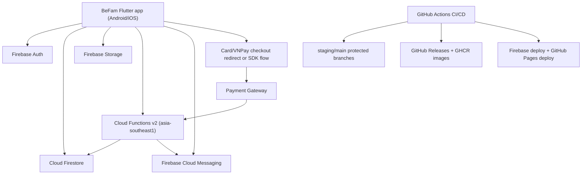

# System Design

_Last reviewed: March 14, 2026_

## High-level architecture

## Runtime boundaries

- mobile app owns presentation logic, local state orchestration, and repository
  calls
- Firestore is the source of truth for core domain entities
- Cloud Functions handle cross-document workflows and push fan-out
- planned billing flow keeps payment verification on server-side callbacks
  before state mutation
- Firebase Rules enforce role and clan scope on reads/writes

## Environment and branch topology

- development integration: `staging`
- production release: `main`
- production Firebase project: `be-fam-3ab23`
- primary functions region: `asia-southeast1`
- scheduler timezone: `Asia/Ho_Chi_Minh`

## Current system characteristics

- Vietnamese locale is the default app locale, with English available
- Firebase auth and app session context are synchronized to custom claims and
  `users/{uid}` session documents
- push notification delivery supports event and scholarship payload targets
- planned subscription model introduces clan-level billing state and renewal
  reminder delivery
- release workflow produces mobile artifacts plus container images

## Design principles in practice

- keep member graph truth in `relationships`, while denormalized arrays on
  `members` optimize reads
- use role-scoped permissions for sensitive operations (relationship writes,
  clan settings, branch-scoped edits)
- prefer explicit state and structured logging over implicit side effects
