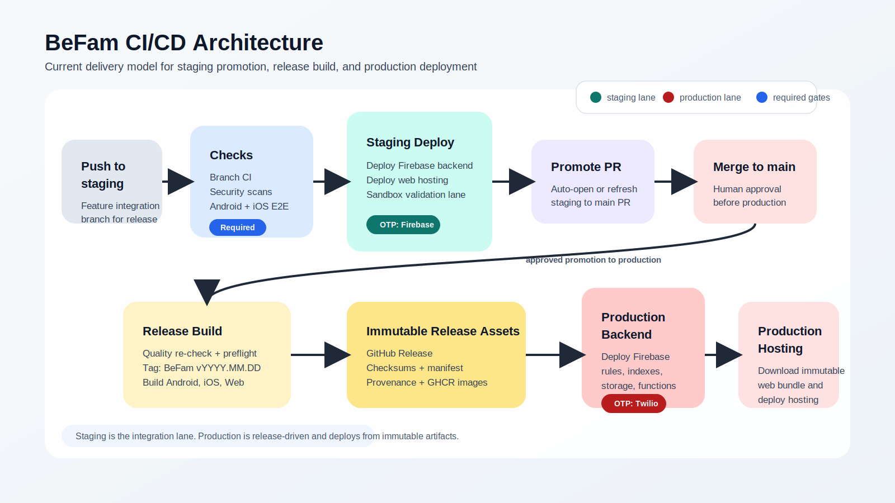
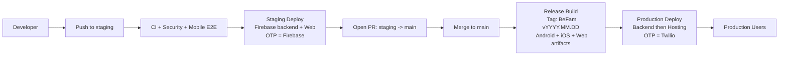
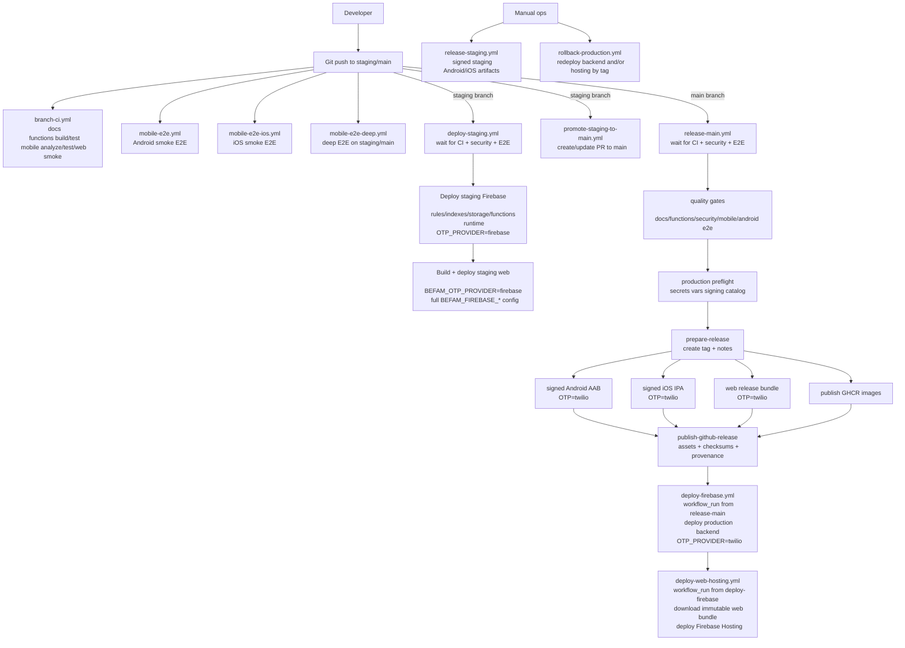
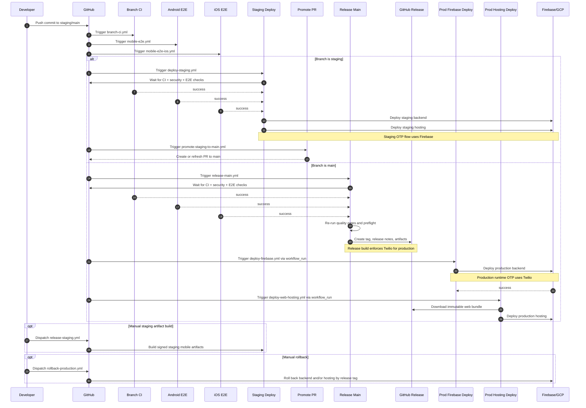

# CI/CD Architecture

_Last reviewed: April 2, 2026_

This page captures the current BeFam delivery architecture as implemented in
GitHub Actions.

Core model:

- `staging` is the integration lane and auto-deploys backend plus web.
- `main` is the release lane and produces immutable production artifacts.
- staging OTP uses Firebase.
- production OTP uses Twilio.

## Leadership View

Slide assets:

- [PNG](../assets/diagrams/ci-cd-leadership.png)
- [SVG](../assets/diagrams/ci-cd-leadership.svg)

## Executive Summary

The delivery system is a promotion pipeline rather than direct-to-production
deployment.

1. Pushes to `staging` and `main` run branch CI and mobile smoke E2E.
2. Pushes to `staging` wait for checks, then deploy to the staging Firebase
   project and staging web hosting.
3. A separate promotion workflow opens or refreshes the `staging -> main`
   release PR.
4. Merges to `main` run an explicit production release workflow that:
   - re-validates quality gates,
   - performs production preflight checks,
   - creates the release tag `vYYYY.MM.DD`,
   - builds signed Android and iOS artifacts,
   - builds the immutable web bundle,
   - publishes release assets and provenance.
5. Production backend deploy and production hosting deploy happen in downstream
   `workflow_run` workflows after the main release succeeds.

## Environment Model

| Environment | Source branch | Deploy mode | OTP provider | Main outputs |
| --- | --- | --- | --- | --- |
| Staging | `staging` | Auto deploy | Firebase | Functions, rules, indexes, storage, staging web |
| Production | `main` | Release then deploy | Twilio | Signed AAB, signed IPA, web bundle, GitHub Release, backend deploy, hosting deploy |

## Current Workflow Map

### Release-branch validation

- `branch-ci.yml`
  - docs validation and build
  - Functions install, build, dead-code gate, tests
  - Flutter analyze, tests, coverage, web smoke
- `mobile-e2e.yml`
  - Android smoke E2E
- `mobile-e2e-ios.yml`
  - iOS smoke E2E
- `mobile-e2e-deep.yml`
  - deeper full-suite mobile regression on `staging` and `main`

### Staging delivery

- `deploy-staging.yml`
  - waits for CI, security, Android E2E, and iOS E2E
  - deploys staging Firebase backend
  - deploys staging web hosting
  - enforces `BEFAM_OTP_PROVIDER=firebase`
- `promote-staging-to-main.yml`
  - creates or refreshes the release PR from `staging` to `main`

### Production release and deploy

- `release-main.yml`
  - waits for upstream checks
  - re-runs quality gates
  - validates production config and signing material
  - cuts release tag `vYYYY.MM.DD`
  - builds Android AAB, iOS IPA, and web release bundle
  - publishes GitHub Release, checksums, manifest, attestations, and GHCR images
- `deploy-firebase.yml`
  - triggered by successful `release-main.yml`
  - deploys production Firebase backend
  - enforces `OTP_PROVIDER=twilio`
- `deploy-web-hosting.yml`
  - triggered by successful production Firebase deploy
  - downloads immutable web bundle from GitHub Release
  - deploys production hosting

### Manual operations

- `release-staging.yml`
  - manual signed staging Android/iOS artifact build
- `rollback-production.yml`
  - manual rollback of production Firebase and/or Hosting to a selected tag
- `deploy-docs.yml`
  - deploys docs site from `main`

## High-Level Design

## Engineer View

## Sequence Diagram

## Operational Notes

- Current mobile store submission is still outside the automated production
  path. The pipeline builds signed artifacts and publishes them to GitHub
  Release, but does not currently submit them to Play Store or App Store.
- Production hosting deploy is artifact-based. It downloads the immutable web
  bundle from the GitHub Release instead of rebuilding from source.
- Staging and production both now fail closed on bundled Firebase fallback in
  release/deploy paths.
- Mobile E2E automation still uses Firebase OTP test flows for CI stability,
  even when validating `main` commits before production release.

## Source Workflows

- `.github/workflows/branch-ci.yml`
- `.github/workflows/mobile-e2e.yml`
- `.github/workflows/mobile-e2e-ios.yml`
- `.github/workflows/mobile-e2e-deep.yml`
- `.github/workflows/deploy-staging.yml`
- `.github/workflows/promote-staging-to-main.yml`
- `.github/workflows/release-main.yml`
- `.github/workflows/deploy-firebase.yml`
- `.github/workflows/deploy-web-hosting.yml`
- `.github/workflows/release-staging.yml`
- `.github/workflows/rollback-production.yml`
