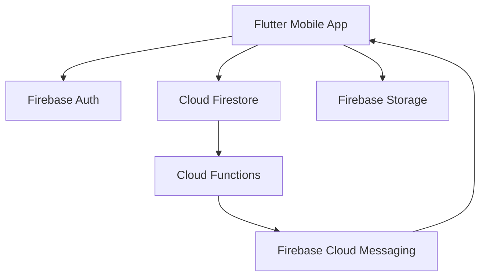
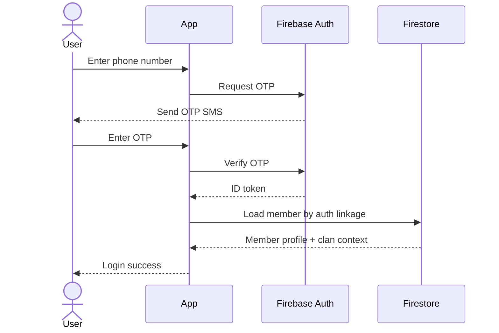
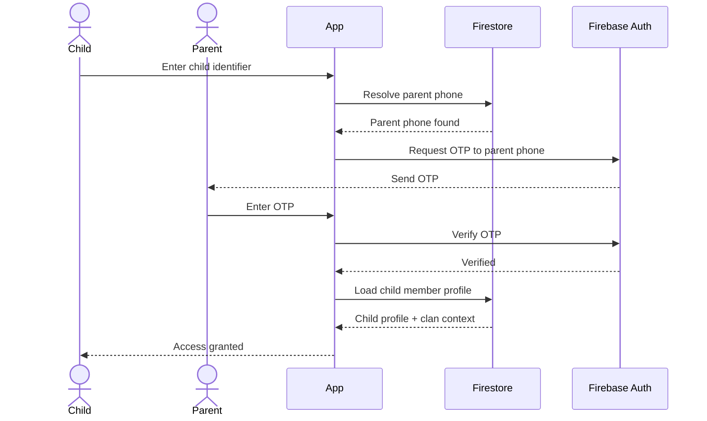
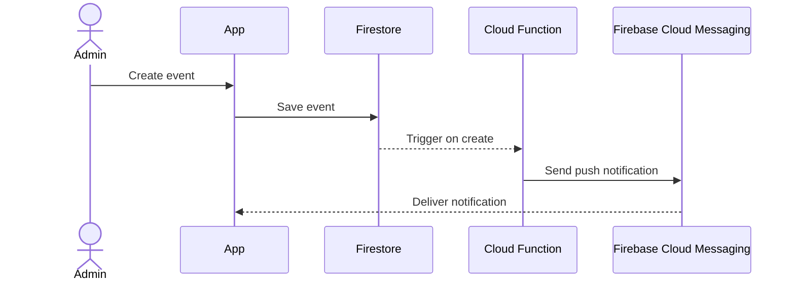

# AI BUILD MASTER DOC
## Family Clan App (Digital Genealogy Platform)

This document is the single source of truth for AI coding agents and reviewers.
The target product is a Flutter mobile app for iOS and Android using Firebase.

## 1. Product Summary

The application helps Vietnamese families, branches, clans, and lineages manage:

- genealogy trees
- family member profiles
- clan events such as death anniversaries and grave visits
- clan funds and scholarship funds
- scholarship programs and achievement submissions
- notifications and reminders

The application prioritizes Vietnamese users first, but the domain model must support global use.

## 2. Product Goals

### Primary goals

- Make it easy for members to find relatives and understand family relationships
- Digitize genealogy records in a modern mobile-first experience
- Improve participation in clan events with reminders and push notifications
- Provide transparent fund management
- Support family scholarship programs for descendants

### Non-goals for MVP

- DNA integration
- full web admin portal
- online payment gateway settlement
- AI-based relationship inference in production
- offline-first sync for all modules

## 3. Personas

### Clan Admin / Trưởng tộc

- creates and manages a clan
- defines branches and leadership roles
- manages events, funds, scholarship programs
- approves sensitive relationship edits

### Branch Admin / Trưởng chi / Phó chi

- manages members within a branch
- proposes relationship changes
- coordinates branch-level events

### Member

- views family tree
- edits own profile
- receives notifications
- donates to funds
- views event details and fund history

### Parent Proxy

- receives OTP for a child without a phone
- manages consent and access for minor accounts

### Student / Descendant

- submits academic achievements for scholarship review

## 4. Product Principles

- Elderly-friendly UX with large tap areas and clear visual hierarchy
- Accurate family relationship model
- Transparent financial records
- Private by default
- Mobile-first, fast, and low-friction
- Simple onboarding using phone number or child identifier

## 5. Core Features

### 5.1 Authentication and Identity

Users can log in using:
- phone number
- child identifier linked to parent phone

Requirements:
- OTP-based login via Firebase Auth
- child login flows through parent phone verification
- automatic clan association if phone number or child identifier matches an invited member record
- support account claim flow when a pre-created member record exists

### 5.2 Genealogy Tree

Each member is a node in the family graph.

Member profile includes:
- full name
- nickname / household name
- gender
- birth date
- optional death date
- phone
- address
- job
- social links
- avatar
- biography / note
- branch / clan association
- parents
- children
- spouse(s) if allowed by cultural data requirements, but MVP assumes one active spouse link
- siblings derived from shared parent relationships

### 5.3 Clan / Branch / Family Hierarchy

Logical hierarchy:
- Clan / Tộc
- Lineage / Họ
- Branch / Chi
- Family household
- Member

MVP data model keeps clan and branch as top-level explicit entities.
Family household is modeled either as a grouping attribute or deferred to phase 2.

### 5.4 Events

Supported events:
- death anniversary (giỗ)
- grave visit (tảo mộ)
- clan meeting
- ceremony / festival
- scholarship ceremony
- custom event

Features:
- create event
- event recurrence policy for yearly memorials
- reminders
- push notifications
- RSVP optional in phase 2
- contribution reminders before event

### 5.5 Funds

Supported fund types:
- scholarship fund
- clan operations fund
- temple / grave maintenance fund
- custom fund

Features:
- create fund
- record donations
- record expenses
- view running balance
- full transaction history
- export-ready ledger design
- role-based write access

### 5.6 Scholarship Program

Features:
- create scholarship program
- define award levels and rules
- submit achievement evidence
- review and approve submissions
- publish winners
- maintain yearly scholarship history

### 5.7 Notifications

Notification categories:
- event reminder
- event created
- scholarship review result
- fund transaction notice
- invitation accepted
- account linked
- system notice

## 6. Success Metrics

MVP success indicators:
- members can log in and see correct clan
- genealogy tree supports at least 10,000 members per clan
- event reminders are sent reliably
- fund ledger is viewable and auditable
- scholarship submissions can be created and reviewed

## 7. Technology Stack

### Mobile
- Flutter 3.x
- Dart with null safety
- Riverpod for state management
- GoRouter for navigation
- Freezed + json_serializable for models
- Firebase SDK

### Backend
- Firebase Auth
- Cloud Firestore
- Firebase Storage
- Cloud Functions for Firebase
- Firebase Cloud Messaging

### Tooling
- Melos optional if monorepo grows
- GitHub Actions for CI/CD
- MkDocs Material for docs
- Conventional commits recommended

## 8. High-Level Architecture



## 9. Mobile Architecture

Use Clean Architecture with feature-first structure.

```text
mobile/befam/
  lib/
    app/
      app.dart
      router/
      theme/
      bootstrap/
    core/
      constants/
      errors/
      utils/
      widgets/
      services/
    features/
      auth/
      clan/
      genealogy/
      members/
      events/
      funds/
      scholarship/
      notifications/
      profile/
    shared/
      models/
      enums/
      extensions/
```

Layering rules:
- presentation depends on domain
- data depends on domain
- domain has no dependency on Flutter or Firebase
- feature modules own their screens, controllers, repositories, models, tests

## 10. Domain Model Summary

Main entities:
- Clan
- Branch
- Member
- Relationship
- Event
- Fund
- Transaction
- ScholarshipProgram
- AwardLevel
- AchievementSubmission
- Notification
- Invite

See `FIRESTORE_PRODUCTION_SCHEMA.md` for full schema.

## 11. Key Constraints

- Firestore is not a graph database
- tree rendering must not fetch recursively node-by-node
- large clans require pagination, caching, and derived indexes
- edits to genealogy relations must be validated to avoid cycles or invalid parent links
- child login requires proxy authentication logic
- privacy boundaries must isolate clan data

## 12. Functional Requirements

### FR-1 Authentication
- user can login via phone number
- user can login via child identifier with parent OTP flow
- system can claim pre-created member record

### FR-2 Member Profile
- view profile
- edit allowed fields
- upload avatar
- manage social links

### FR-3 Genealogy
- add member
- connect parent-child
- connect spouse
- display ancestry and descendants
- search member by name and branch

### FR-4 Events
- create event
- yearly recurrence for memorials
- reminders
- notifications

### FR-5 Funds
- create fund
- record donation
- record expense
- calculate balance
- view transaction history

### FR-6 Scholarship
- create program
- define award levels
- submit achievement
- review submission
- award result notification

## 13. Non-Functional Requirements

- startup time under 3 seconds on mid-range devices after warm install
- screen interactions under 300ms for common operations
- list pagination for member search
- role-based access control
- audit timestamps on all mutable entities
- support UTF-8, Vietnamese names, and long text safely
- observability for cloud functions errors

## 14. Security Model

Roles:
- SUPER_ADMIN
- CLAN_ADMIN
- BRANCH_ADMIN
- MEMBER
- PARENT_PROXY

Principles:
- clan isolation
- least privilege
- server-side validation of sensitive operations
- immutable audit fields where appropriate
- storage paths scoped by clan and entity

## 15. Sequence Diagrams

### 15.1 Phone Login



### 15.2 Child Login



### 15.3 Create Event and Notify



## 16. Roadmap

### Phase 1 - MVP
- auth
- clan + branch setup
- member profiles
- genealogy management
- tree visualization
- basic events
- push notifications

### Phase 2
- funds
- scholarship
- richer search
- export tools
- annual recurring memorial automation

### Phase 3
- family map
- storytelling / memory archive
- AI relationship assistance
- analytics dashboards

## 17. Repository Layout

```text
family-clan-app/
  docs/
  mobile/
    befam/
  firebase/
    functions/
    firestore.rules
    firestore.indexes.json
    storage.rules
  .github/
    workflows/
    ISSUE_TEMPLATE/
    pull_request_template.md
  mkdocs.yml
  README.md
```

## 18. Coding Standards for AI Agents

- use null-safe Dart
- no business logic directly in widgets
- use repository abstractions
- add tests for controllers, repositories, and pure domain logic
- add comments only where logic is not obvious
- keep files small and feature-scoped
- prefer composition over inheritance
- centralize error mapping
- use typed models for Firestore payloads
- keep writes idempotent where possible

## 19. Review Checklist for Human Reviewer

- feature matches spec
- access control is correct
- no direct Firestore field-name typos
- screen UX is simple and readable
- tests exist
- cloud function side effects are idempotent
- docs updated

## 20. Linked Docs

- `FIRESTORE_PRODUCTION_SCHEMA.md`
- `FLUTTER_IMPLEMENTATION_PLAN.md`
- `AI_AGENT_TASKS_150_ISSUES.md`
- `GENEALOGY_TREE_ALGORITHM.md`
- `FIREBASE_CLOUD_FUNCTIONS.md`
- `GITHUB_AUTOMATION_AI_PIPELINE.md`
