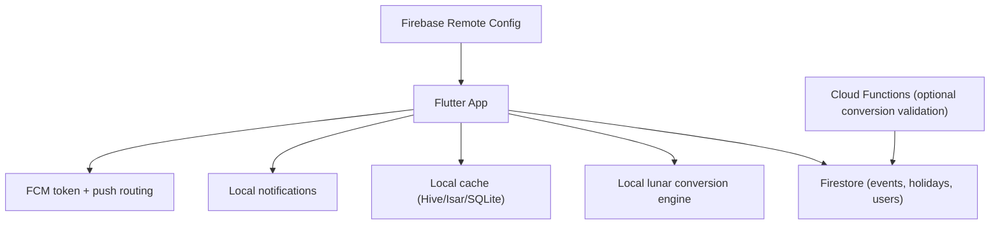

# Epic: Dual Calendar System (Solar + Asian Lunar)

_Last reviewed: March 17, 2026_

## Goal

Enable users to view and schedule events with both Gregorian (solar) and Asian
lunar calendars in the BeFam Flutter app, backed by Firebase.

The system supports:

- lunar date display in calendar views
- lunar holiday highlighting
- event creation and recurrence by lunar date
- regional lunar calendar differences (CN, VN, KR)

## Scope

### In scope

- dual date display in month/day calendar views
- local solar-lunar conversion in Flutter with cache
- Firestore model support for lunar events and holiday definitions
- annual lunar recurrence resolution to solar dates
- leap month rule support for recurring events
- reminder scheduling after yearly lunar-to-solar resolution

### Out of scope

- server-only conversion as the primary path
- support for non-Asian lunar systems
- full holiday CMS outside Firestore/Remote Config

## Architecture overview

## Core capabilities

1. Solar + lunar date display
2. Solar-to-lunar and lunar-to-solar conversion
3. Lunar holiday highlighting
4. Lunar-based recurring events
5. Regional lunar calendar support (CN, VN, KR)
6. Firebase-backed event storage
7. Notification scheduling for resolved dates

## Delivery plan

### Sprint 1

- dual-date calendar UI scaffolding
- local conversion abstraction and package integration
- baseline cache strategy

### Sprint 2

- Firestore event schema updates
- lunar event create/edit flow
- yearly recurrence resolution logic

### Sprint 3

- lunar holiday highlight system
- reminder scheduling pipeline
- leap month rule handling and tests

### Sprint 4

- regional variants (CN/VN/KR)
- performance optimization and profiling
- release hardening and analytics checks

## Definition of done

- dual calendar views are production-ready on Android and iOS
- lunar recurring events resolve correctly across years, including leap-month
  scenarios
- event rendering and reminder scheduling stay stable and performant in normal
  clan usage windows
