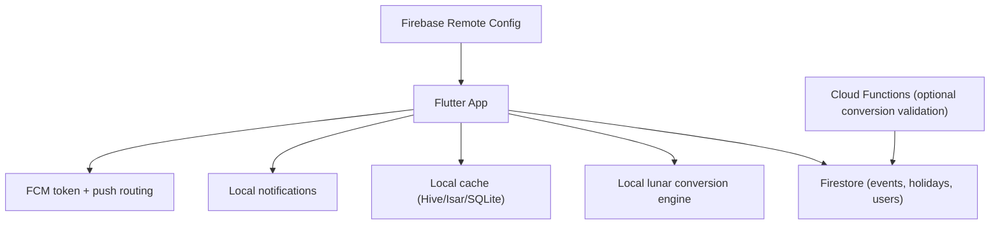

# Epic: Hệ thống lịch kép (Dương lịch + Âm lịch Á Đông)

_Cập nhật gần nhất: 17/03/2026_

## Mục tiêu

Cho phép người dùng xem và lên lịch sự kiện theo cả dương lịch và âm lịch trong
ứng dụng BeFam, sử dụng Firebase làm backend.

Hệ thống hỗ trợ:

- hiển thị ngày âm lịch trong lịch
- đánh dấu ngày lễ âm lịch
- tạo sự kiện và lặp lại theo ngày âm lịch
- khác biệt lịch âm theo vùng (CN, VN, KR)

## Phạm vi

### Trong phạm vi

- hiển thị song song ngày dương và âm ở màn hình tháng/ngày
- chuyển đổi dương-âm cục bộ trong Flutter, có cache
- hỗ trợ schema Firestore cho sự kiện âm lịch và ngày lễ
- resolve lặp lại âm lịch hàng năm sang ngày dương
- hỗ trợ quy tắc tháng nhuận cho sự kiện lặp lại
- lên lịch nhắc sau khi resolve âm -> dương theo từng năm

### Ngoài phạm vi

- dùng server-only conversion làm luồng chính
- hỗ trợ hệ âm lịch ngoài khu vực Á Đông
- xây CMS ngày lễ đầy đủ ngoài Firestore/Remote Config

## Tổng quan kiến trúc

## Năng lực chính

1. hiển thị ngày dương + âm cùng lúc
2. chuyển đổi dương <-> âm
3. đánh dấu ngày lễ âm lịch
4. sự kiện lặp lại theo âm lịch
5. hỗ trợ vùng lịch âm (CN, VN, KR)
6. lưu trữ sự kiện bằng Firebase
7. nhắc lịch theo ngày dương đã resolve

## Kế hoạch triển khai

### Sprint 1

- dựng giao diện lịch kép
- tích hợp lớp chuyển đổi cục bộ
- chiến lược cache nền tảng

### Sprint 2

- cập nhật schema Firestore cho sự kiện âm lịch
- form tạo/sửa sự kiện âm lịch
- logic resolve lặp lại theo năm

### Sprint 3

- hệ đánh dấu ngày lễ âm lịch
- pipeline nhắc lịch
- xử lý quy tắc tháng nhuận + test

### Sprint 4

- tối ưu theo vùng CN/VN/KR
- tối ưu hiệu năng và profiling
- hardening trước phát hành

## Điều kiện hoàn thành

- lịch kép sẵn sàng production trên Android và iOS
- sự kiện âm lịch lặp lại đúng qua nhiều năm, kể cả tháng nhuận
- render lịch và nhắc lịch ổn định trong quy mô sử dụng thực tế
