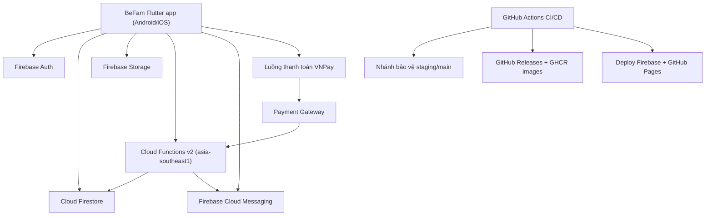

# Thiết kế hệ thống

_Cập nhật gần nhất: 17/03/2026_

## Kiến trúc tổng thể

## Ranh giới runtime

- mobile chịu trách nhiệm lớp hiển thị và điều phối trạng thái cục bộ
- Firestore là nguồn dữ liệu chuẩn cho nghiệp vụ
- Cloud Functions xử lý luồng nhiều document và gửi push
- xác nhận thanh toán và thay đổi trạng thái gói nằm ở phía server
- quyền lợi gói được tính phía server và phản ánh về UI
- Firebase Rules đảm bảo phạm vi clan và phân quyền

## Môi trường và topology nhánh

- nhánh tích hợp: `staging`
- nhánh phát hành production: `main`
- Firebase production project: `be-fam-3ab23`
- vùng functions chính: `asia-southeast1`
- múi giờ scheduler: `Asia/Ho_Chi_Minh`

## Đặc tính hệ thống hiện tại

- mặc định ứng dụng dùng tiếng Việt, có tiếng Anh dự phòng
- ngữ cảnh phiên đồng bộ qua custom claims và `users/{uid}`
- push notification hỗ trợ các nhóm mục tiêu chính
- workflow release tạo artifact mobile và image container

## Nguyên tắc thiết kế đang áp dụng

- quan hệ chuẩn nằm ở `relationships`; mảng phi chuẩn hóa ở `members` để tăng
  tốc độ đọc
- thao tác nhạy cảm phải kiểm soát theo vai trò và phạm vi
- ưu tiên trạng thái rõ ràng và log có cấu trúc hơn side effect ngầm
